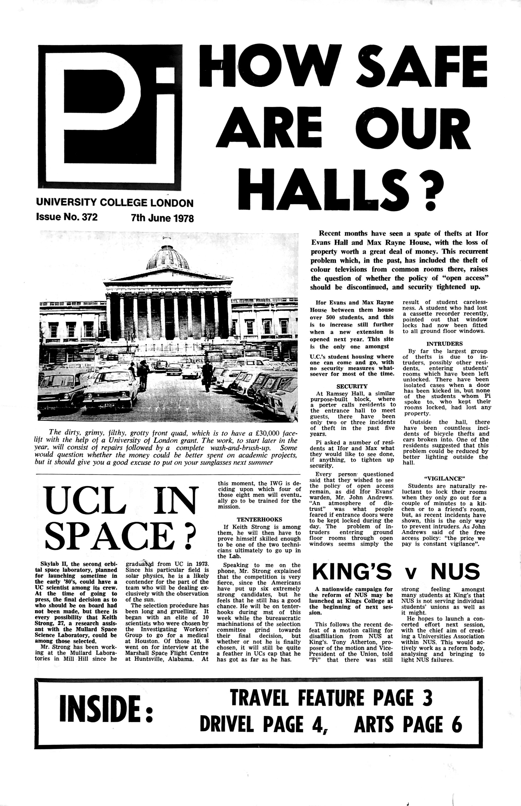

# Newspaper-OCR-LLM
Uses LLM to iterate through a collection of scanned pages of historical multi-column newspapers and OCR the output to extract: articles and headline, along with some additional metadata. It returns a collection of sticles identifies on each page in JSON format. 

---

## What it does

- Reads scanned page images (JPG) from an **input directory**
- Sends them to an OpenAI model (e.g. o4-mini-2025-04-16) with a structured prompt optimised externally on OpenAI Playground for **layout‑aware OCR**
- Returns per‑page JSON with:
  - `articles[]` (title/headline, content/article body)
  - page/issue metadata
- Writes outputs to an **output directory** (one JSON file per scanned page image)

---

## How to run

1. Regiter and get an OpenAI API Key;
2. Configure input and putput folders;
3. Add scanned page images as JPG;
4. Run the Cell on Jupyter notebook.

---